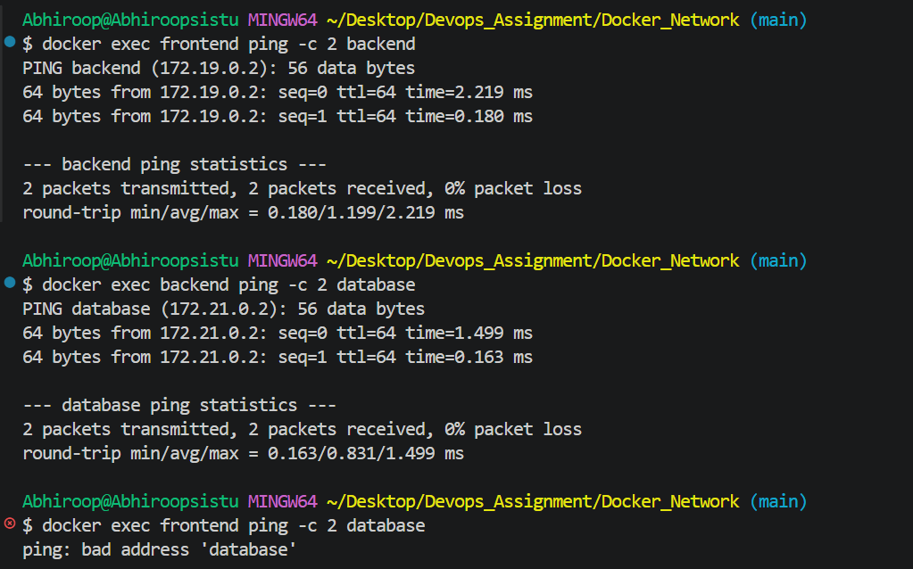
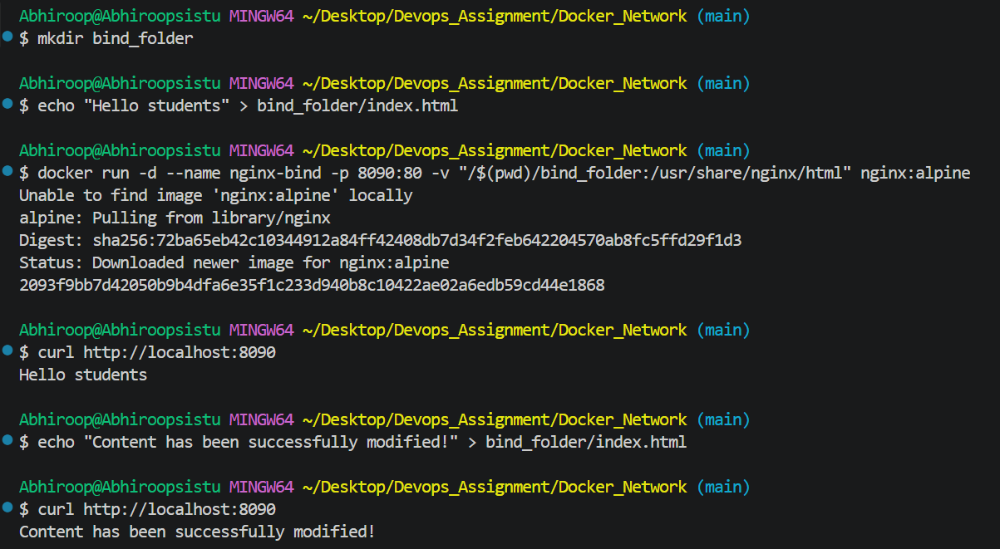
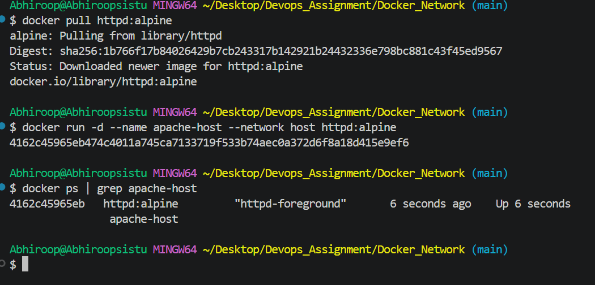

# Docker Networking & Volumes Assignment

**Author:** Abhiroop Sistu  
**Enrollment Number:** 24bcs10287  

---

## Task 1: Container Networking
**Objective:** Create isolated networks and establish inter-container communication.
*   Created three networks: `front-net`, `back-net`, and `db-net`.
*   Placed the `frontend` container on `front-net`.
*   Placed the `database` container on `db-net`.
*   Bridged the `backend` container across both `front-net` and `db-net`.
*   Successfully verified that the backend could communicate with both, while the frontend remained isolated from the database.

### Connectivity Verification

---

## Task 2: Host Network
**Objective:** Deploy an Apache2 container bypassing Docker's default bridge network.
*   Pulled the official `httpd` image.
*   Executed the container using `--network host`, binding it directly to the host machine's network interfaces.

### Host Execution Verification

---

## Task 3: Bind Mounts
**Objective:** Synchronize a local directory with a container directory in real-time.
*   Created a local folder with an `index.html` file.
*   Mounted the folder to an Nginx container at `/usr/share/nginx/html`.
*   Modified the local file and verified that the container served the updated content instantly without requiring a restart.

### Bind Mount Verification

---

## Task 4: Docker Overlay Networks Research

### What is an Overlay Network?
A Docker overlay network is a distributed network that spans across multiple Docker daemon hosts. It sits "on top" of the host-specific networks, allowing containers connected to it (even if they are on entirely different physical or virtual machines) to communicate securely as if they were on the same local subnet.

### Primary Use Cases
1. **Docker Swarm & Kubernetes:** Overlay networks are the foundational networking layer for container orchestration, allowing services to scale securely across a cluster of multiple nodes.
2. **Multi-Host Communication:** When a microservices architecture requires a backend on Server A to securely communicate with a database on Server B without exposing ports to the public internet.
3. **Encrypted Traffic:** Overlay networks natively support IPSec encryption out of the box, securing container-to-container payload traffic across nodes.

### How it Works
Docker utilizes a technology called VXLAN (Virtual eXtensible Local Area Network). The Docker daemon encapsulates the container network packets into standard UDP packets on the host machine. These encapsulated packets are sent across the physical network to the destination host, where the receiving Docker daemon unwraps them and delivers the original packet to the target container.